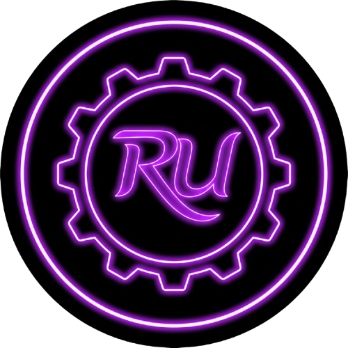
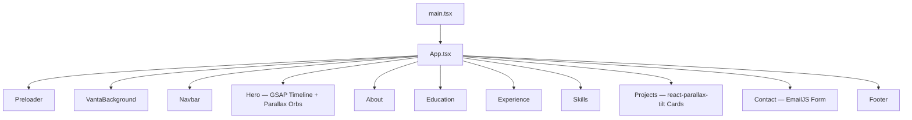

<div align="center">

# Rudra Patel — Portfolio

<p align="center">
	<a href="https://github.com/Rudra-P9/Rudra_p9-Portfolio/stargazers"></a>
	<a href="https://github.com/Rudra-P9/Rudra_p9-Portfolio/network/members"></a>
	<a href="#tech-stack"></a>
	<a href="LICENSE"></a>
	<a href="https://rudra-p9.github.io/Rudra_p9-Portfolio/"></a>
</p>

<p align="center">
	<a href="https://github.com/Rudra-P9/Rudra_p9-Portfolio/issues"></a>
	<a href="https://github.com/Rudra-P9/Rudra_p9-Portfolio/pulls"></a>
	
	
	
	<a href="#contributing"></a>
</p>

</div>

<p align="center">
	<picture>
		
	</picture>
</p>

An immersive, dark-themed personal portfolio built with React, TypeScript, and Tailwind CSS — featuring a cinematic Vanta.js network hero, smooth Locomotive Scroll, GSAP-powered animations, 3D tilt project cards, and a live EmailJS contact form.

<p align="center"><strong><a href="https://rudra-p9.github.io/Rudra_p9-Portfolio/">Live Demo → rudra-p9.github.io/Rudra_p9-Portfolio</a></strong></p>

<details>
	<summary><b>Table of Contents</b></summary>

- [Overview](#overview)
- [Features](#features)
- [Tech Stack](#tech-stack)
- [Architecture](#architecture)
- [Quick Start](#quick-start)
- [Environment Variables](#environment-variables)
- [Scripts](#scripts)
- [Project Structure](#project-structure)
- [Deployment](#deployment)
- [Contributing](#contributing)
- [FAQ](#faq)
- [Maintainer](#maintainer)
- [License](#license)
- [Contact](#contact)

</details>

## Overview

This project is a modern single-page application scaffolded with **Vite** and fully typed with **TypeScript**. The visual foundation is a live **Vanta.js** network animation rendered over a deep dark background. Page sections are composed in React and animated with **GSAP ScrollTrigger** and **Framer Motion**, while smooth inertia scrolling is handled by **Locomotive Scroll**.

The site is deployed to **GitHub Pages** via a GitHub Actions CD pipeline that performs a clean `npm install` on the Linux runner to ensure the correct native binaries are resolved regardless of the lockfile's origin platform.

## Features

- **Animated Hero**: Full-screen Vanta.js network background with GSAP-driven headline entrance animations and parallax floating orbs.
- **Cinematic Preloader**: Custom animated preloader with completion callback before the main content fades in.
- **About**: Personal introduction section with animated entrance via Framer Motion.
- **Education**: Timeline-style education history with scroll-triggered reveals.
- **Experience**: Work history cards with GSAP stagger animations.
- **Skills**: Categorized skill grid (Languages, Tools, Frameworks) with animated reveal.
- **Projects Gallery**: 3D-tilt project cards using `react-parallax-tilt`, tag chips, and quick links to source and live demo.
- **Contact Form**: EmailJS-powered form with animated success/error states and GSAP scroll-triggered entrance.
- **Smooth UX**: Locomotive Scroll for momentum-based scrolling, Framer Motion transitions, and CSS glassmorphism cards throughout.
- **Responsive**: Mobile-first layout using Tailwind CSS with full responsiveness across all sections.
- **CI/CD**: GitHub Actions workflow that builds and deploys to GitHub Pages automatically on every push to `main`.

## Tech Stack

| Layer | Technology |
|---|---|
| Runtime | React 18, TypeScript |
| Styling | Tailwind CSS v4, Vanta.js |
| Motion | GSAP (ScrollTrigger), Framer Motion, Locomotive Scroll |
| 3D / Effects | react-parallax-tilt, Vanta NET |
| Forms | EmailJS (`@emailjs/browser`) |
| Icons | Lucide React |
| Tooling | Vite, tsx |
| Deployment | GitHub Pages, GitHub Actions |

## Architecture



## Quick Start

**Prerequisites**
- Node.js 18+ (developed and tested on Node 20)

**Install and run**

```bash
npm install --legacy-peer-deps
npm run dev
```

**Build and preview**

```bash
npm run build
npm run preview
```

## Environment Variables

The contact form requires the following EmailJS credentials. Create a `.env` or `.env.local` in the project root:

```dotenv
VITE_EMAILJS_SERVICE_ID=your_emailjs_service_id
VITE_EMAILJS_TEMPLATE_ID=your_emailjs_template_id
VITE_EMAILJS_PUBLIC_KEY=your_emailjs_public_key
```

These are consumed in `src/components/Contact.tsx` via `import.meta.env`.

> **Note:** The current build has credentials inlined for development convenience — move them to `.env` for production and add `.env` to `.gitignore` before open-sourcing.

## Scripts

| Script | Action |
|---|---|
| `npm run dev` | Start Vite dev server on port 3000 |
| `npm run build` | Build production assets to `dist/` |
| `npm run preview` | Preview the built site locally |
| `npm run lint` | Type-check `src/` with `tsc --noEmit` |
| `npm run clean` | Remove `dist/` directory |

## Project Structure

```
Rudrap9/
├─ .github/
│  └─ workflows/
│     └─ deploy.yml          # GitHub Actions — clean install + Pages deploy
├─ index.html                # Entry point, favicon, Vanta CDN scripts
├─ package.json              # Scripts and dependencies
├─ vite.config.ts            # Vite config — base path, TailwindCSS plugin
├─ tsconfig.json             # TypeScript config
├─ public/
│  ├─ logo0.png              # Site logo / favicon
│  ├─ resume.pdf             # Downloadable résumé
│  └─ bmw_m4.mp4             # Hero background video asset
└─ src/
   ├─ App.tsx                # Root shell — Locomotive Scroll + section composition
   ├─ main.tsx               # React DOM bootstrap
   ├─ index.css              # Global styles, CSS custom properties
   ├─ assets/                # Image imports (escape room game screenshot, etc.)
   ├─ lib/                   # Shared utility functions
   └─ components/
      ├─ Preloader.tsx        # Boot-screen animation
      ├─ VantaBackground.tsx  # Vanta NET canvas wrapper
      ├─ Navbar.tsx           # Sticky nav with active-section highlighting
      ├─ Hero.tsx             # Full-screen hero with GSAP timeline
      ├─ About.tsx            # Bio section
      ├─ Education.tsx        # Education timeline
      ├─ Experience.tsx       # Work experience cards
      ├─ Skills.tsx           # Skill category grid
      ├─ Projects.tsx         # Tilt project cards
      ├─ Contact.tsx          # EmailJS contact form
      ├─ Footer.tsx           # Footer with social links
      ├─ EmailButton.tsx      # Reusable email CTA component
      └─ ErrorBoundary.tsx    # React error boundary wrapper
```

## Deployment

**GitHub Pages (current)**
- Base path set to `/Rudra_p9-Portfolio/` in `vite.config.ts`.
- The GitHub Actions workflow (`deploy.yml`) runs on every push to `main`:
  1. Removes `node_modules` and `package-lock.json` for a clean Linux-native install.
  2. Runs `npm install --legacy-peer-deps` to resolve correct platform binaries.
  3. Runs `npm run build` and publishes `dist/` to GitHub Pages.

**Any Static Host**
- Build with `npm run build` and serve the `dist/` directory from any CDN or static host.
- Update `base` in `vite.config.ts` to `/` if deploying to a root domain.

## Contributing

Contributions, issues, and feature requests are welcome!

1. Fork the repo
2. Create a feature branch (`git checkout -b feat/your-feature`)
3. Commit with clear messages (`feat: add dark mode toggle`)
4. Open a pull request

## FAQ

**Dev server won't start?**
- Ensure Node.js 18+ is installed. Install dependencies with `npm install --legacy-peer-deps`.

**Vanta background not showing?**
- Confirm the Vanta CDN scripts in `index.html` are loading. Check browser console for network errors.

**Contact form not sending?**
- Verify the EmailJS service ID, template ID, and public key in `src/components/Contact.tsx` (or move them to `.env`).

**Build fails on CI with native binary errors?**
- The workflow uses `rm -rf node_modules package-lock.json && npm install` to force a fresh Linux-compatible resolution. Do not commit a `package-lock.json` generated on macOS for CI use.

## Maintainer

<table>
	<tr>
		<td width="80">
			
		</td>
		<td>
			<b>Rudra Patel</b><br/>
			Computer Science Student — University of South Carolina<br/>
			<a href="https://rudra-p9.github.io/Rudra_p9-Portfolio/">Website</a> •
			<a href="mailto:Rudra.patel70@yahoo.com">Email</a> •
			<a href="https://www.linkedin.com/in/rudrap9/">LinkedIn</a> •
			<a href="https://github.com/Rudra-P9">GitHub</a>
		</td>
	</tr>
	<tr>
		<td colspan="2">
			⭐ If you found this useful or inspiring, consider starring the repo!
		</td>
	</tr>
</table>

## License

This project is open source under the MIT License. See `LICENSE` for details.

## Contact

- **Portfolio:** https://rudra-p9.github.io/Rudra_p9-Portfolio/
- **Email:** Rudra.patel70@yahoo.com
- **LinkedIn:** https://www.linkedin.com/in/rudrap9/
- **GitHub:** https://github.com/Rudra-P9
- **Instagram:** https://www.instagram.com/rudra_p9/
